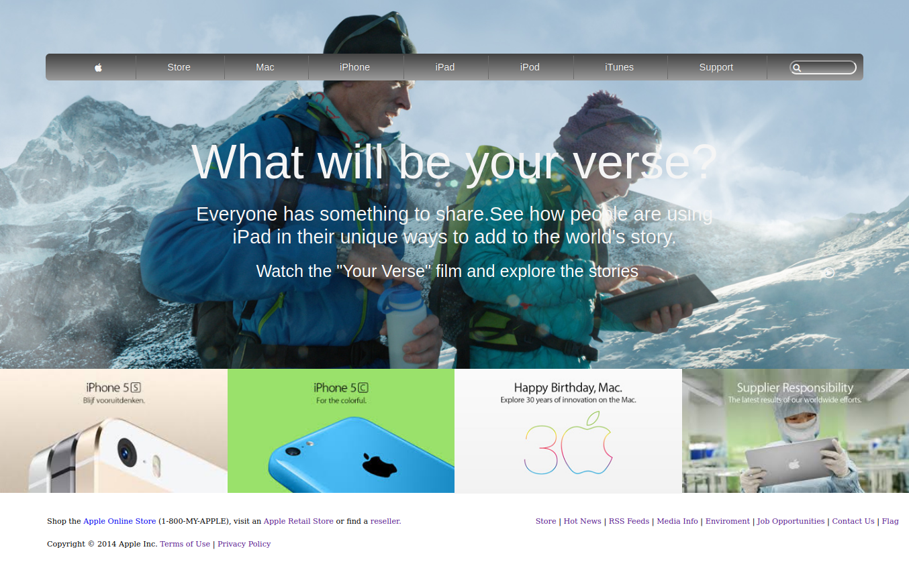

# Apple Homepage Clone

> This project is about making an accurate clone of the Apple homepage.

Clone of the homepage semi-responsive design nav bar with icon inside input field that resize when on focus
image with lins to the same page and floated footer

## Built With

- Html5
- CSS3
- Love 
- Patience

## Live Demo

[Live Demo Link](https://raw.githack.com/ioilmio/apple-homepage/development/index.html)

## Getting Started

To get a local copy up and running follow these simple example steps.

### Prerequisites

Just a pc and internet connection

## Authors

👤 **Author1**

- Github: [@ioilmio](https://github.com/ioilmio)
- Twitter: [@ioilmio](https://twitter.com/ioilmio)
- Linkedin: [linkedin](https://www.linkedin.com/in/illuminato-salvatore)

## 🤝 Contributing

Contributions, issues and feature requests are welcome!

Feel free to check the [issues page](https://github.com/ioilmio/apple-homepage/issues).

## Show your support

Give a ⭐️ if you like this project!

## Acknowledgments

- Hat tip to anyone whose code was used
- Inspiration
- etc

## 📝 License

This project is [MIT](lic.url) licensed.
